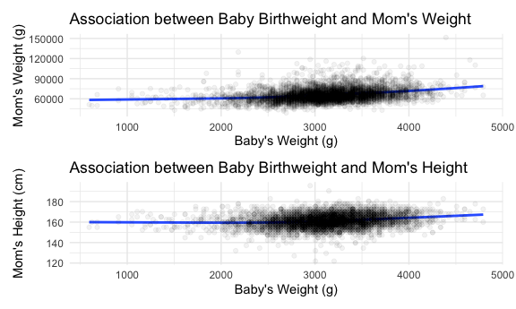
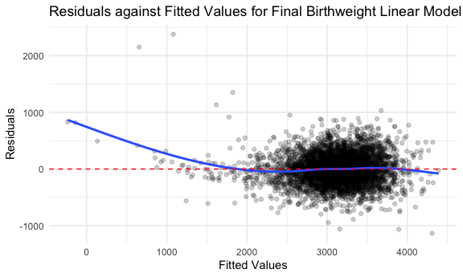
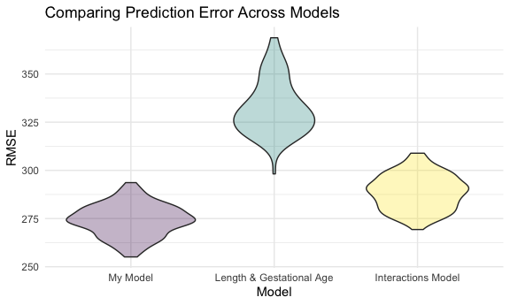
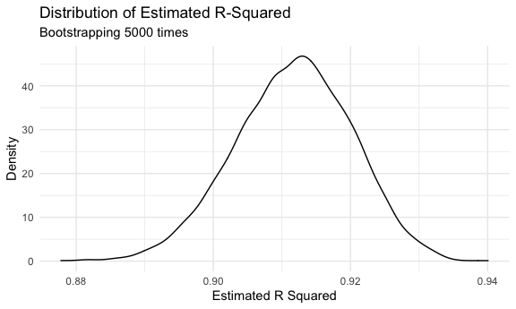
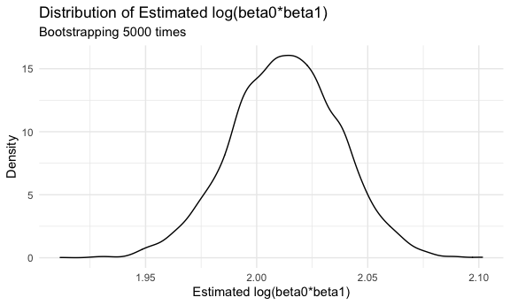

P8105 Homework \#6
================
Zachary Katz (UNI: zak2132)
12/4/2021

-   [Problem 1](#problem-1)
-   [Problem 2](#problem-2)

## Problem 1

``` r
# Load and clean the data
baby_df = 
  # Load in the data and clean column names to be more descriptive
  read_csv("./data/birthweight.csv") %>% 
  janitor::clean_names() %>% 
  rename(
    momwt = delwt,
    momrace = mrace,
    dadrace = frace,
    avg_daily_cigs = smoken,
    momheight = mheight
  ) %>% 
  # Recode categoricals as factor variables with descriptive levels
  mutate(
    dadrace = 
      case_when(
        dadrace == 1 ~ "White",
        dadrace == 2 ~ "Black",
        dadrace == 3 ~ "Asian",
        dadrace == 4 ~ "Puerto Rican",
        dadrace == 8 ~ "Other",
        dadrace == 9 ~ "Unknown",
        TRUE ~ ""
      ) %>% as.factor(),
    momrace = 
      case_when(
        momrace == 1 ~ "White",
        momrace == 2 ~ "Black",
        momrace == 3 ~ "Asian",
        momrace == 4 ~ "Puerto Rican",
        momrace == 8 ~ "Other",
        TRUE ~ ""
      ) %>% as.factor(),
    malform =
      case_when(
        malform == 0 ~ "Absent",
        malform == 1 ~ "Present"
      ) %>% as.factor(),
    babysex = 
      ifelse(
        babysex == 1, "Male", "Female"
        ) %>% as.factor(),
    # Convert units for consistency (to grams and centimeters)
    momwt_grams = momwt * 453.592,
    momheight_cm = momheight * 2.54) %>% 
  # Rename columns with units where applicable and remove no longer necessary variables
  rename(
    bwt_grams = bwt,
    wtgain_grams = wtgain,
  ) %>% 
  select(-momheight, -momwt)
```

    ## Rows: 4342 Columns: 20

    ## ── Column specification ────────────────────────────────────────────────────────
    ## Delimiter: ","
    ## dbl (20): babysex, bhead, blength, bwt, delwt, fincome, frace, gaweeks, malf...

    ## 
    ## ℹ Use `spec()` to retrieve the full column specification for this data.
    ## ℹ Specify the column types or set `show_col_types = FALSE` to quiet this message.

``` r
# Check for missingness -- no missing values!
baby_df %>% 
  skimr::skim() %>% 
  select(skim_variable, n_missing, complete_rate) %>% 
  knitr::kable()
```

| skim\_variable   | n\_missing | complete\_rate |
|:-----------------|-----------:|---------------:|
| babysex          |          0 |              1 |
| dadrace          |          0 |              1 |
| malform          |          0 |              1 |
| momrace          |          0 |              1 |
| bhead            |          0 |              1 |
| blength          |          0 |              1 |
| bwt\_grams       |          0 |              1 |
| fincome          |          0 |              1 |
| gaweeks          |          0 |              1 |
| menarche         |          0 |              1 |
| momage           |          0 |              1 |
| parity           |          0 |              1 |
| pnumlbw          |          0 |              1 |
| pnumsga          |          0 |              1 |
| ppbmi            |          0 |              1 |
| ppwt             |          0 |              1 |
| avg\_daily\_cigs |          0 |              1 |
| wtgain\_grams    |          0 |              1 |
| momwt\_grams     |          0 |              1 |
| momheight\_cm    |          0 |              1 |

After loading the data, the following steps were taken to clean and tidy
the tibble:

-   Renaming variables to be more accurate and descriptive
-   Converting relevant variables to factors with appropriate levels
-   Ensuring consistency of units (grams and centimeters rather than
    pounds and inches for weight and height, respectively)
-   Checking for missingness; all variables havea 100% completeness rate

``` r
# Explore head of data frame
baby_df %>% 
  head(10) %>% 
  knitr::kable()
```

| babysex | bhead | blength | bwt\_grams | fincome | dadrace | gaweeks | malform | menarche | momage | momrace | parity | pnumlbw | pnumsga |    ppbmi | ppwt | avg\_daily\_cigs | wtgain\_grams | momwt\_grams | momheight\_cm |
|:--------|------:|--------:|-----------:|--------:|:--------|--------:|:--------|---------:|-------:|:--------|-------:|--------:|--------:|---------:|-----:|-----------------:|--------------:|-------------:|--------------:|
| Female  |    34 |      51 |       3629 |      35 | White   |    39.9 | Absent  |       13 |     36 | White   |      3 |       0 |       0 | 26.27184 |  148 |                0 |            29 |     80285.78 |        160.02 |
| Male    |    34 |      48 |       3062 |      65 | Black   |    25.9 | Absent  |       14 |     25 | Black   |      0 |       0 |       0 | 21.34485 |  128 |                0 |            28 |     70760.35 |        165.10 |
| Female  |    36 |      50 |       3345 |      85 | White   |    39.9 | Absent  |       12 |     29 | White   |      0 |       0 |       0 | 23.56517 |  137 |                1 |            11 |     67131.62 |        162.56 |
| Male    |    34 |      52 |       3062 |      55 | White   |    40.0 | Absent  |       14 |     18 | White   |      0 |       0 |       0 | 21.84508 |  127 |               10 |            30 |     71213.94 |        162.56 |
| Female  |    34 |      52 |       3374 |       5 | White   |    41.6 | Absent  |       13 |     20 | White   |      0 |       0 |       0 | 21.02642 |  130 |                1 |            26 |     70760.35 |        167.64 |
| Male    |    33 |      52 |       3374 |      55 | White   |    40.7 | Absent  |       12 |     23 | White   |      0 |       0 |       0 | 18.60030 |  115 |                0 |            14 |     58513.37 |        167.64 |
| Female  |    33 |      46 |       2523 |      96 | Black   |    40.3 | Absent  |       14 |     29 | Black   |      0 |       0 |       0 | 14.27034 |  105 |                0 |            21 |     57152.59 |        182.88 |
| Female  |    33 |      49 |       2778 |       5 | White   |    37.4 | Absent  |       12 |     19 | White   |      0 |       0 |       0 | 21.81089 |  119 |                0 |            21 |     63502.88 |        157.48 |
| Male    |    36 |      52 |       3515 |      85 | White   |    40.3 | Absent  |       11 |     13 | White   |      0 |       0 |       0 | 19.88106 |  105 |                0 |            41 |     66224.43 |        154.94 |
| Male    |    33 |      50 |       3459 |      75 | Black   |    40.7 | Absent  |       12 |     19 | Black   |      0 |       0 |       0 | 24.94123 |  145 |                4 |            24 |     76657.05 |        162.56 |

``` r
# Check structure of data frame
str(baby_df)
```

    ## tibble [4,342 × 20] (S3: tbl_df/tbl/data.frame)
    ##  $ babysex       : Factor w/ 2 levels "Female","Male": 1 2 1 2 1 2 1 1 2 2 ...
    ##  $ bhead         : num [1:4342] 34 34 36 34 34 33 33 33 36 33 ...
    ##  $ blength       : num [1:4342] 51 48 50 52 52 52 46 49 52 50 ...
    ##  $ bwt_grams     : num [1:4342] 3629 3062 3345 3062 3374 ...
    ##  $ fincome       : num [1:4342] 35 65 85 55 5 55 96 5 85 75 ...
    ##  $ dadrace       : Factor w/ 5 levels "Asian","Black",..: 5 2 5 5 5 5 2 5 5 2 ...
    ##  $ gaweeks       : num [1:4342] 39.9 25.9 39.9 40 41.6 ...
    ##  $ malform       : Factor w/ 2 levels "Absent","Present": 1 1 1 1 1 1 1 1 1 1 ...
    ##  $ menarche      : num [1:4342] 13 14 12 14 13 12 14 12 11 12 ...
    ##  $ momage        : num [1:4342] 36 25 29 18 20 23 29 19 13 19 ...
    ##  $ momrace       : Factor w/ 4 levels "Asian","Black",..: 4 2 4 4 4 4 2 4 4 2 ...
    ##  $ parity        : num [1:4342] 3 0 0 0 0 0 0 0 0 0 ...
    ##  $ pnumlbw       : num [1:4342] 0 0 0 0 0 0 0 0 0 0 ...
    ##  $ pnumsga       : num [1:4342] 0 0 0 0 0 0 0 0 0 0 ...
    ##  $ ppbmi         : num [1:4342] 26.3 21.3 23.6 21.8 21 ...
    ##  $ ppwt          : num [1:4342] 148 128 137 127 130 115 105 119 105 145 ...
    ##  $ avg_daily_cigs: num [1:4342] 0 0 1 10 1 0 0 0 0 4 ...
    ##  $ wtgain_grams  : num [1:4342] 29 28 11 30 26 14 21 21 41 24 ...
    ##  $ momwt_grams   : num [1:4342] 80286 70760 67132 71214 70760 ...
    ##  $ momheight_cm  : num [1:4342] 160 165 163 163 168 ...

``` r
# Explore summary of data frame
skimr::skim(baby_df)
```

|                                                  |          |
|:-------------------------------------------------|:---------|
| Name                                             | baby\_df |
| Number of rows                                   | 4342     |
| Number of columns                                | 20       |
| \_\_\_\_\_\_\_\_\_\_\_\_\_\_\_\_\_\_\_\_\_\_\_   |          |
| Column type frequency:                           |          |
| factor                                           | 4        |
| numeric                                          | 16       |
| \_\_\_\_\_\_\_\_\_\_\_\_\_\_\_\_\_\_\_\_\_\_\_\_ |          |
| Group variables                                  | None     |

Data summary

**Variable type: factor**

| skim\_variable | n\_missing | complete\_rate | ordered | n\_unique | top\_counts                             |
|:---------------|-----------:|---------------:|:--------|----------:|:----------------------------------------|
| babysex        |          0 |              1 | FALSE   |         2 | Mal: 2230, Fem: 2112                    |
| dadrace        |          0 |              1 | FALSE   |         5 | Whi: 2123, Bla: 1911, Pue: 248, Asi: 46 |
| malform        |          0 |              1 | FALSE   |         2 | Abs: 4327, Pre: 15                      |
| momrace        |          0 |              1 | FALSE   |         4 | Whi: 2147, Bla: 1909, Pue: 243, Asi: 43 |

**Variable type: numeric**

| skim\_variable   | n\_missing | complete\_rate |     mean |       sd |       p0 |      p25 |      p50 |      p75 |      p100 | hist  |
|:-----------------|-----------:|---------------:|---------:|---------:|---------:|---------:|---------:|---------:|----------:|:------|
| bhead            |          0 |              1 |    33.65 |     1.62 |    21.00 |    33.00 |    34.00 |    35.00 |     41.00 | ▁▁▆▇▁ |
| blength          |          0 |              1 |    49.75 |     2.72 |    20.00 |    48.00 |    50.00 |    51.00 |     63.00 | ▁▁▁▇▁ |
| bwt\_grams       |          0 |              1 |  3114.40 |   512.15 |   595.00 |  2807.00 |  3132.50 |  3459.00 |   4791.00 | ▁▁▇▇▁ |
| fincome          |          0 |              1 |    44.11 |    25.98 |     0.00 |    25.00 |    35.00 |    65.00 |     96.00 | ▃▇▅▂▃ |
| gaweeks          |          0 |              1 |    39.43 |     3.15 |    17.70 |    38.30 |    39.90 |    41.10 |     51.30 | ▁▁▂▇▁ |
| menarche         |          0 |              1 |    12.51 |     1.48 |     0.00 |    12.00 |    12.00 |    13.00 |     19.00 | ▁▁▂▇▁ |
| momage           |          0 |              1 |    20.30 |     3.88 |    12.00 |    18.00 |    20.00 |    22.00 |     44.00 | ▅▇▂▁▁ |
| parity           |          0 |              1 |     0.00 |     0.10 |     0.00 |     0.00 |     0.00 |     0.00 |      6.00 | ▇▁▁▁▁ |
| pnumlbw          |          0 |              1 |     0.00 |     0.00 |     0.00 |     0.00 |     0.00 |     0.00 |      0.00 | ▁▁▇▁▁ |
| pnumsga          |          0 |              1 |     0.00 |     0.00 |     0.00 |     0.00 |     0.00 |     0.00 |      0.00 | ▁▁▇▁▁ |
| ppbmi            |          0 |              1 |    21.57 |     3.18 |    13.07 |    19.53 |    21.03 |    22.91 |     46.10 | ▃▇▁▁▁ |
| ppwt             |          0 |              1 |   123.49 |    20.16 |    70.00 |   110.00 |   120.00 |   134.00 |    287.00 | ▅▇▁▁▁ |
| avg\_daily\_cigs |          0 |              1 |     4.15 |     7.41 |     0.00 |     0.00 |     0.00 |     5.00 |     60.00 | ▇▁▁▁▁ |
| wtgain\_grams    |          0 |              1 |    22.08 |    10.94 |   -46.00 |    15.00 |    22.00 |    28.00 |     89.00 | ▁▁▇▁▁ |
| momwt\_grams     |          0 |              1 | 66030.33 | 10073.29 | 39008.91 | 59420.55 | 64863.66 | 71213.94 | 151499.73 | ▅▇▁▁▁ |
| momheight\_cm    |          0 |              1 |   161.27 |     6.75 |   121.92 |   157.48 |   160.02 |   165.10 |    195.58 | ▁▁▇▂▁ |

In total, there are 4342 observations and 20 variables in `baby_df`,
where each observation represents one baby birth. We also note that
`pnumlbw` and `pnumgsa` are both 0 across all observations, so we are
unlikely to use these in future regression analysis.

#### Propose a Regression Model for Birthweight

First, let’s check that a linear model is appropriate by ensuring our
data meets the normality assumption:

``` r
# Check normality assumption by plotting birthweight distribution
baby_df %>% 
  ggplot(aes(x = bwt_grams)) + 
  geom_histogram(binwidth = 30) + 
  labs(
    title = "Birthweight Distribution",
    x = "Birthweight (g)",
    y = "Count"
  )
```


Birthweight appears roughly normally distributed, with mean of
3114.4039613 grams and SD of 512.1540963.

Although unsure yet which continuous predictors we’ll use, we can choose
a couple of potential ones to check the linearity assumption for fun as
well:

``` r
bwt_vs_momwt = 
  baby_df %>% 
  ggplot(aes(x = bwt_grams, y = momwt_grams)) + 
  geom_smooth(se = FALSE) + 
  geom_point(alpha = 0.05) + 
  labs(
    title = "Association between Baby Birthweight and Mom's Weight",
    x = "Baby's Weight (g)",
    y = "Mom's Weight (g)"
  )

bwt_vs_momht = 
  baby_df %>% 
  ggplot(aes(x = bwt_grams, y = momheight_cm)) + 
  geom_smooth(se = FALSE) + 
  geom_point(alpha = 0.05) + 
  labs(
    title = "Association between Baby Birthweight and Mom's Height",
    x = "Baby's Weight (g)",
    y = "Mom's Height (cm)"
  )

bwt_vs_momwt + bwt_vs_momht
```

    ## `geom_smooth()` using method = 'gam' and formula 'y ~ s(x, bs = "cs")'
    ## `geom_smooth()` using method = 'gam' and formula 'y ~ s(x, bs = "cs")'



We find a bend in the curve for both graphs at around baby’s weight of
2500 grams. That said, we can proceed for now with linear regression
assuming we meet the linearity assumption, but may want to be cautious
going forward after this finding.

One way to approach model development is to hypothesize relevant
covariates a priori, and then use the “best subset” procedure to select
the ideal subset of covariates from our hypothesized superset based on
the maximization of adjusted R-squared and minimization of BIC and Cp.

Let’s begin by fitting a preliminary model using covariates we believe
best predict birth weight. First, we exclude variables due to low cell
counts or fewer than two levels, including `malform`, `pnumlbw`, and
`pnumgsa`. Then, we can explore the literature on low birth weight,
where we find some known associations with birth weight; for example,
smoking is known to be associated with lower birth weight. Prior
findings of significant association with birthweight include parental
race, baby’s sex, baby’s head circumference and length at birth,
gestational age, maternal height and age, and mother’s weight gain
during pregnancy. We develop our preliminary model as follows

``` r
# Proposed preliminary linear model
prelim_model = 
  lm(
    bwt_grams ~ babysex + bhead + blength + dadrace + gaweeks + momheight_cm + momage + momrace + avg_daily_cigs + wtgain_grams,
    data = baby_df
  )

# Develop a clean summary table and examine which covariates have p < 0.05
summary(prelim_model) %>% 
  broom::tidy() %>% 
  mutate(
    p_value = format.pval(p.value, digits = 2, eps = 0.05)
  ) %>% 
  select(-p.value) %>%
  arrange(p_value) %>% 
  knitr::kable()
```

| term                |     estimate |   std.error |   statistic | p\_value |
|:--------------------|-------------:|------------:|------------:|:---------|
| (Intercept)         | -6378.570139 | 139.6266628 | -45.6830380 | &lt;0.05 |
| babysexMale         |   -30.041772 |   8.4978678 |  -3.5352129 | &lt;0.05 |
| bhead               |   132.567581 |   3.4545594 |  38.3746713 | &lt;0.05 |
| blength             |    75.582238 |   2.0247088 |  37.3299293 | &lt;0.05 |
| gaweeks             |    11.311329 |   1.4666983 |   7.7121029 | &lt;0.05 |
| momheight\_cm       |     4.331281 |   0.6459860 |   6.7049154 | &lt;0.05 |
| avg\_daily\_cigs    |    -4.730148 |   0.5885015 |  -8.0376135 | &lt;0.05 |
| wtgain\_grams       |     3.845771 |   0.3927061 |   9.7930004 | &lt;0.05 |
| momraceWhite        |   124.089228 |  72.0502198 |   1.7222602 | 0.085    |
| momage              |     1.926025 |   1.1673571 |   1.6499019 | 0.099    |
| dadracePuerto Rican |   -62.100802 |  78.8217524 |  -0.7878638 | 0.431    |
| momracePuerto Rican |    60.735736 |  81.1945099 |   0.7480276 | 0.454    |
| momraceBlack        |   -36.705203 |  81.2232488 |  -0.4519051 | 0.651    |
| dadraceWhite        |   -19.439373 |  69.5817885 |  -0.2793744 | 0.780    |
| dadraceOther        |   -10.581287 |  98.0166846 |  -0.1079539 | 0.914    |
| dadraceBlack        |     6.151923 |  79.1644482 |   0.0777107 | 0.938    |

A quick first glance at the data tells us that some promising covariates
of the ones included in our preliminary model are `babysex`, `babyhead`,
`babylength`, `gaweeks`, `momheight_cm`, `avg_daily_cigs`, and
`wtgain_grams`, which all have p-values under 0.05.

With this initial model, we can use the “best subset” method to
determine the ideal set of covariates to include in a more final model.

``` r
# Limit data frame to covariates from preliminary model
prelim_covariates = 
  baby_df %>% 
  select(bwt_grams, babysex, bhead, blength, dadrace, gaweeks, momheight_cm , momage, momrace, avg_daily_cigs, wtgain_grams)

# Run regsubsets for best subset model across preliminary covariates
best_subset_model = regsubsets(
  bwt_grams ~ ., 
  data = prelim_covariates
  )

# Save best subset summary as object
best_subset_summary = summary(best_subset_model)

# Save summary stats for each subset model to data frame
stats_summary_subsets = data.frame(
  adjusted_r2 = best_subset_summary$adjr2,
  cp = best_subset_summary$cp,
  bic = best_subset_summary$bic
)

# Bind with variables used in each model for easy review
subset_models =
  as.data.frame(best_subset_summary$outmat) %>% 
  cbind(stats_summary_subsets) %>% 
  arrange(desc(adjusted_r2), cp, bic)

# Print summary overview of best subsets
subset_models %>% 
  knitr::kable(
    digits = 2
  )
```

|         | babysexMale | bhead | blength | dadraceBlack | dadraceOther | dadracePuerto Rican | dadraceWhite | gaweeks | momheight\_cm | momage | momraceBlack | momracePuerto Rican | momraceWhite | avg\_daily\_cigs | wtgain\_grams | adjusted\_r2 |      cp |      bic |
|:--------|:------------|:------|:--------|:-------------|:-------------|:--------------------|:-------------|:--------|:--------------|:-------|:-------------|:--------------------|:-------------|:-----------------|:--------------|-------------:|--------:|---------:|
| 8 ( 1 ) | \*          | \*    | \*      |              |              |                     |              | \*      | \*            |        |              |                     | \*           | \*               | \*            |         0.71 |   10.67 | -5371.33 |
| 7 ( 1 ) |             | \*    | \*      |              |              |                     |              | \*      | \*            |        |              |                     | \*           | \*               | \*            |         0.71 |   21.34 | -5367.03 |
| 6 ( 1 ) |             | \*    | \*      |              |              |                     |              | \*      |               |        |              |                     | \*           | \*               | \*            |         0.71 |   65.02 | -5330.02 |
| 5 ( 1 ) |             | \*    | \*      |              |              |                     |              | \*      |               |        |              |                     | \*           |                  | \*            |         0.71 |  124.61 | -5277.95 |
| 4 ( 1 ) |             | \*    | \*      |              |              |                     |              |         |               |        |              |                     | \*           |                  | \*            |         0.70 |  183.84 | -5227.05 |
| 3 ( 1 ) |             | \*    | \*      |              |              |                     |              |         |               |        |              |                     | \*           |                  |               |         0.70 |  280.94 | -5141.17 |
| 2 ( 1 ) |             | \*    | \*      |              |              |                     |              |         |               |        |              |                     |              |                  |               |         0.68 |  506.39 | -4940.65 |
| 1 ( 1 ) |             | \*    |         |              |              |                     |              |         |               |        |              |                     |              |                  |               |         0.56 | 2376.33 | -3529.91 |

We select the best model of the subsets by maximizing adjusted R2 and
minimizing prediction error (cp and BIC in this case). The model that
best achieves these goals incorporates `babysex`, `bhead`, `blength`,
`gaweeks`, `momheight_cm`, `momrace`, `avg_daily_cigs`, and
`wtgain_grams`. This means we exclude `dadrace` and `momage` from our
final model.

We run our final model as follows, and then show a plot of model
residuals against fitted values:

``` r
# Run final model using optimized set of covariates
final_model = lm(
  bwt_grams ~ babysex + bhead + blength + gaweeks + momheight_cm + momrace + avg_daily_cigs + wtgain_grams,
  data = baby_df
)

# Print tidied summary of final model
summary(final_model) %>% 
  broom::tidy() %>% 
  mutate(
    p_value = format.pval(p.value, digits = 2, eps = 0.05)
  ) %>% 
  select(-p.value) %>%
  arrange(p_value) %>% 
  knitr::kable(
    digits = 2
  )
```

| term                | estimate | std.error | statistic | p\_value |
|:--------------------|---------:|----------:|----------:|:---------|
| (Intercept)         | -6355.94 |    138.14 |    -46.01 | &lt;0.05 |
| babysexMale         |   -29.59 |      8.49 |     -3.48 | &lt;0.05 |
| bhead               |   132.75 |      3.45 |     38.46 | &lt;0.05 |
| blength             |    75.47 |      2.02 |     37.29 | &lt;0.05 |
| gaweeks             |    11.46 |      1.46 |      7.83 | &lt;0.05 |
| momheight\_cm       |     4.44 |      0.64 |      6.91 | &lt;0.05 |
| momraceWhite        |   100.27 |     42.34 |      2.37 | &lt;0.05 |
| avg\_daily\_cigs    |    -4.71 |      0.59 |     -8.01 | &lt;0.05 |
| wtgain\_grams       |     3.77 |      0.39 |      9.68 | &lt;0.05 |
| momraceBlack        |   -40.25 |     42.31 |     -0.95 | 0.34     |
| momracePuerto Rican |    -4.40 |     45.40 |     -0.10 | 0.92     |

``` r
# Plot model residuals against fitted values
baby_df %>% 
  add_predictions(final_model) %>% 
  add_residuals(final_model) %>% 
  ggplot(aes(x = pred, y = resid)) + 
  geom_point(alpha = 0.2) + 
  geom_smooth(se = FALSE) + 
  geom_hline(yintercept = 0, linetype = "dashed", color = "red") + 
  labs(
    title = "Residuals against Fitted Values for Final Birthweight Linear Model",
    x = "Fitted Values",
    y = "Residuals"
  )
```

    ## `geom_smooth()` using method = 'gam' and formula 'y ~ s(x, bs = "cs")'



We note that there are a couple of babies with predicted birthweight
less than 0, but recognize that they are outliers. Most residuals appear
roughly evenly dispersed across predicted (fitted) values, meaning that
except for the lower end of our fitted values, we tend to see constant
variance. However, the fact that residuals are not scattered around 0 on
the low end of our fitted values indicates there may be some violation
of the assumption of constant variance.

#### Model Comparisons

We need to compare our model to two others:

-   A model that uses length at birth and gestational age as predictors
    (main effects only)
-   A model that uses head circumference, length, sex, and all
    interactions (including the three-way interaction) between these

``` r
# Develop model using length at birth and gestational age
baby_df %>% 
  lm(bwt_grams ~ blength + gaweeks, data = .) %>% 
  broom::tidy() %>% 
  knitr::kable(
    digits = 2
  )
```

| term        | estimate | std.error | statistic | p.value |
|:------------|---------:|----------:|----------:|--------:|
| (Intercept) | -4347.67 |     97.96 |    -44.38 |       0 |
| blength     |   128.56 |      1.99 |     64.60 |       0 |
| gaweeks     |    27.05 |      1.72 |     15.74 |       0 |

``` r
# Develop model using head circumference, length, sex, and interactions
baby_df %>% 
  lm(bwt_grams ~ bhead + blength + babysex + bhead*blength + bhead*babysex + blength*babysex + bhead*blength*babysex, data = .) %>% 
  broom::tidy() %>% 
  knitr::kable(
    digits = 2
  )
```

| term                      | estimate | std.error | statistic | p.value |
|:--------------------------|---------:|----------:|----------:|--------:|
| (Intercept)               |  -801.95 |   1102.31 |     -0.73 |    0.47 |
| bhead                     |   -16.60 |     34.09 |     -0.49 |    0.63 |
| blength                   |   -21.65 |     23.37 |     -0.93 |    0.35 |
| babysexMale               | -6374.87 |   1677.77 |     -3.80 |    0.00 |
| bhead:blength             |     3.32 |      0.71 |      4.67 |    0.00 |
| bhead:babysexMale         |   198.39 |     51.09 |      3.88 |    0.00 |
| blength:babysexMale       |   123.77 |     35.12 |      3.52 |    0.00 |
| bhead:blength:babysexMale |    -3.88 |      1.06 |     -3.67 |    0.00 |

Now, we can compare our models using cross-validated prediction error:

``` r
# Create cross-validation datasets
# Split original sample into 80% training, 20% testing, with 100 resamples
cv_df = 
  crossv_mc(baby_df, 100) %>% 
  mutate(
    train = map(train, as_tibble),
    test = map(test, as_tibble)
  )

# Fit each of the three models on training data
# Then, compute RMSE on testing data
cv_df = 
  cv_df %>% 
  mutate(
    my_model = map(.x = train, ~lm(bwt_grams ~ babysex + bhead + blength + gaweeks + momheight_cm + momrace + avg_daily_cigs + wtgain_grams, data = .x)),
    model2 = map(.x = train, ~lm(bwt_grams ~ blength + gaweeks, data = .x)),
    model3 = map(.x = train, ~lm(bwt_grams ~ bhead + blength + babysex + bhead*blength + bhead*babysex + blength*babysex + bhead*blength*babysex, data = .x))
  ) %>% 
  mutate(
    rmse_my_model = map2_dbl(.x = my_model,.y = test, ~rmse(model = .x, data = .y)),
    rmse_model2 = map2_dbl(.x = model2,.y = test, ~rmse(model = .x, data = .y)),
    rmse_model3 = map2_dbl(.x = model3,.y = test, ~rmse(model = .x, data = .y))
  )

# Data frame with RMSEs across models
rmse_df = cv_df %>% 
  select(rmse_my_model, rmse_model2, rmse_model3) %>% 
  pivot_longer(
    everything(),
    names_to = "model",
    values_to = "RMSE",
    names_prefix = "rmse_"
  )

# Print table of summary mean RMSE across models
rmse_df %>% 
  group_by(model) %>% 
  summarize(
    mean_RMSE = mean(RMSE)
  ) %>% 
  knitr::kable()
```

| model     | mean\_RMSE |
|:----------|-----------:|
| model2    |   333.3882 |
| model3    |   288.8237 |
| my\_model |   274.4480 |

From the table, we observe that my model has the lowest mean RMSE across
cross-validation trials. Let’s plot for comparison of RMSE
distributions:

``` r
# Violin plot of RMSE distribution for each model
rmse_df %>% 
  mutate(
    # Maintain original model order
    model = fct_inorder(model)
  ) %>% 
  ggplot(aes(x = model, y = RMSE, fill = model)) + 
  geom_violin(alpha = 0.3) + 
  labs(
    title = "Comparing Prediction Error Across Models",
    x = "Model",
    y = "RMSE"
  ) + 
  scale_x_discrete(
    labels = c("My Model", "Length & Gestational Age", "Interactions Model")
  ) + 
  theme(legend.position = "none")
```



My proposed model has lower prediction error (minimized RMSE) compared
to the other two models provided. The second model, which looks only at
baby length and gestational age, performs the worst, while the
interactions model is somewhere in the middle. I would select my model
for prediction purposes, but may want to further explore whether we
achieve the constant variance assumption based on the residuals
vs. fitted values graph already provided. Ultimately, if we violate this
assumption, I might go with the interactions model – assuming it has
better dispersion of residuals across fitted values.

## Problem 2

``` r
# Load the data
weather_df = 
  rnoaa::meteo_pull_monitors(
    c("USW00094728"),
    var = c("PRCP", "TMIN", "TMAX"), 
    date_min = "2017-01-01",
    date_max = "2017-12-31") %>%
  mutate(
    name = recode(id, USW00094728 = "CentralPark_NY"),
    tmin = tmin / 10,
    tmax = tmax / 10) %>%
  select(name, id, everything())
```

    ## Registered S3 method overwritten by 'hoardr':
    ##   method           from
    ##   print.cache_info httr

    ## using cached file: ~/Library/Caches/R/noaa_ghcnd/USW00094728.dly

    ## date created (size, mb): 2021-10-05 10:29:46 (7.602)

    ## file min/max dates: 1869-01-01 / 2021-10-31

``` r
weather_df
```

    ## # A tibble: 365 × 6
    ##    name           id          date        prcp  tmax  tmin
    ##    <chr>          <chr>       <date>     <dbl> <dbl> <dbl>
    ##  1 CentralPark_NY USW00094728 2017-01-01     0   8.9   4.4
    ##  2 CentralPark_NY USW00094728 2017-01-02    53   5     2.8
    ##  3 CentralPark_NY USW00094728 2017-01-03   147   6.1   3.9
    ##  4 CentralPark_NY USW00094728 2017-01-04     0  11.1   1.1
    ##  5 CentralPark_NY USW00094728 2017-01-05     0   1.1  -2.7
    ##  6 CentralPark_NY USW00094728 2017-01-06    13   0.6  -3.8
    ##  7 CentralPark_NY USW00094728 2017-01-07    81  -3.2  -6.6
    ##  8 CentralPark_NY USW00094728 2017-01-08     0  -3.8  -8.8
    ##  9 CentralPark_NY USW00094728 2017-01-09     0  -4.9  -9.9
    ## 10 CentralPark_NY USW00094728 2017-01-10     0   7.8  -6  
    ## # … with 355 more rows

#### Bootstrapping

Developing a simple linear regression with `tmax` as the response and
`tmin` as the predictor, we’re interested in the distribution of the
estimated r-squared and log(beta\_0\*beta\_1). First, let’s bootstrap
5000 times:

``` r
# Bootstrap 5000 times
bootstrap_df = 
  weather_df %>% 
  bootstrap(n = 5000, id = "strap_num") %>% 
  # Convert resample objects to df and clean up bootstrap results
  mutate(
    strap = map(strap, as_tibble),
    models = map(strap, ~lm(tmax ~ tmin, data = .x)),
    estimates = map(models, broom::tidy),
    summary = map(models, broom::glance)
  ) %>% 
  select(-strap, -models) %>% 
  unnest(summary)

# Bootstrap 5000 times
bootstrap_df = 
  weather_df %>% 
  bootstrap(n = 5000, id = "strap_num") %>% 
  # Convert resample objects to df and clean up bootstrap results
  mutate(
    strap = map(strap, as_tibble),
    models = map(strap, ~lm(tmax ~ tmin, data = .x)),
    estimates = map(models, broom::tidy),
    summary = map(models, broom::glance)
  ) %>% 
  select(-strap, -models) %>% 
  unnest(c(estimates, summary), names_repair = "universal") %>% 
  select(strap_num, term, estimate, r.squared) %>% 
  pivot_wider(
    id_cols = c(strap_num, r.squared),
    names_from = term,
    values_from = estimate
  ) %>% 
  rename(
    beta0 = `(Intercept)`, 
    beta1 = "tmin"
  ) %>% 
  mutate(
    logb0_b1 = log(beta0 * beta1)
  ) %>% 
  select(-beta0, -beta1)
```

    ## New names:
    ## * statistic -> statistic...5
    ## * p.value -> p.value...6
    ## * statistic -> statistic...10
    ## * p.value -> p.value...11

``` r
# Check head of bootstrap df
bootstrap_df %>% 
  head(10) %>% 
  knitr::kable(
    digits = 2
  )
```

| strap\_num | r.squared | logb0\_b1 |
|:-----------|----------:|----------:|
| 0001       |      0.92 |      2.00 |
| 0002       |      0.93 |      2.03 |
| 0003       |      0.90 |      2.08 |
| 0004       |      0.92 |      2.01 |
| 0005       |      0.91 |      2.01 |
| 0006       |      0.91 |      2.01 |
| 0007       |      0.91 |      2.04 |
| 0008       |      0.90 |      2.00 |
| 0009       |      0.91 |      1.99 |
| 0010       |      0.92 |      1.99 |

#### R-squared

Now we can extract the 95% confidence interval for the estimated
r-squared when we perform a simple linear regression `tmax ~ tmin`.

``` r
# Find 95% confidence interval for R-squared
r_squared = bootstrap_df %>% 
  select(r.squared) %>% 
  summarize(
    lower_ci = quantile(r.squared, 0.025),
    upper_ci = quantile(r.squared, 0.975)
  )

# Print table of 95% CI
r_squared %>%
  knitr::kable(
    digits = 3
  )
```

| lower\_ci | upper\_ci |
|----------:|----------:|
|     0.894 |     0.927 |

Our 95% confidence interval ranges from 0.894 to 0.927. And we can also
plot the distribution of our estimated r-squared as follows:

``` r
# Plot distribution of r-squared after bootstrapping
bootstrap_df %>% 
  select(r.squared) %>% 
  ggplot(aes(x = r.squared)) + 
  geom_density() + 
  labs(
    title = "Distribution of Estimated R-Squared",
    subtitle = "Bootstrapping 5000 times",
    x = "Estimated R Squared",
    y = "Density"
  )
```



We find from this graph that the R-squared values from bootstrapping
appear normally distributed with mean 0.912 and SD 0.008.

#### log(B\_0 \* B\_1)

Similarly, we can extract the 95% confidence interval for the estimated
log(beta\_0 \* beta\_1) when we perform a simple linear regression
`tmax ~ tmin`.

``` r
# Find 95% confidence interval for log(beta0*beta1)
log_b0_b1 = bootstrap_df %>% 
  select(logb0_b1) %>% 
  summarize(
    lower_ci = quantile(logb0_b1, 0.025),
    upper_ci = quantile(logb0_b1, 0.975)
  )

# Print table of 95% CI
log_b0_b1 %>%
  knitr::kable(
    digits = 3
  )
```

| lower\_ci | upper\_ci |
|----------:|----------:|
|     1.965 |     2.059 |

And also can plot its distribution across the 5000 bootstraps:

``` r
# Plot distribution of log(b0b1) after bootstrapping
bootstrap_df %>% 
  select(logb0_b1) %>% 
  ggplot(aes(x = logb0_b1)) + 
  geom_density() + 
  labs(
    title = "Distribution of Estimated log(beta0*beta1)",
    subtitle = "Bootstrapping 5000 times",
    x = "Estimated log(beta0*beta1)",
    y = "Density"
  )
```



Our 95% confidence interval ranges from 1.965 to 2.060. Again, it
appears our estimated log(b0 \* b1) is normally distributed with mean
2.013 and SD 0.024.
